<div align="center">

# 🏨 Predicting Hotel Reservation Cancellations

### Turning booking behavior into smarter hotel operations

[](https://www.python.org/)
[](https://jupyter.org/)
[](https://scikit-learn.org/)
[](https://xgboost.readthedocs.io/)
[](https://shap.readthedocs.io/)

**An end-to-end machine learning project that predicts whether a hotel booking is likely to be canceled — and explains why.**

[Explore the notebook](./Notebook/Predicting_Hotel_Reservation_Cancellations.ipynb) · [Open in Colab](https://colab.research.google.com/github/Rohan-Rg30/Predicting_Hotel_Reservation_Cancellations/blob/main/Notebook/Predicting_Hotel_Reservation_Cancellations.ipynb) · [Report an issue](https://github.com/Rohan-Rg30/Predicting_Hotel_Reservation_Cancellations/issues)

</div>

---

## Why this project matters

Hotel cancellations create empty rooms, unstable revenue forecasts, and avoidable operational friction. This project uses reservation-level data to estimate cancellation risk before arrival so a hotel team can prioritize follow-ups, improve inventory planning, and make more informed revenue decisions.

The repository contains a complete notebook workflow: data exploration, preprocessing, imbalance handling, baseline benchmarking, hyperparameter tuning, validation checks, SHAP explainability, and an interactive prediction function for new reservations.

> **Project goal:** build a useful, interpretable cancellation-risk signal — not just a high score on a leaderboard.

## At a glance

| Item | Detail |
| --- | --- |
| **Task** | Binary classification: `Canceled` vs `Not_Canceled` |
| **Dataset** | 36,275 hotel reservations and 19 columns |
| **Best baseline in the notebook** | Tuned Random Forest |
| **Baseline test accuracy** | **90.21%** |
| **Baseline test ROC-AUC** | **0.9558** |
| **Validation** | Stratified 80/20 split, 5-fold cross-validation, and model comparison |
| **Interpretability** | SHAP feature-impact analysis |
| **Primary artifact** | [Jupyter notebook](./Notebook/Predicting_Hotel_Reservation_Cancellations.ipynb) |

> **Metric context:** the figures above are from the notebook’s baseline model comparison on the held-out test split. The notebook later tunes several models using cross-validated ROC-AUC.

## Results snapshot

The initial benchmark compares six classifiers after preprocessing and training-set resampling with SMOTETomek.

| Model | Accuracy | Precision | Recall | F1 | ROC-AUC |
| --- | ---: | ---: | ---: | ---: | ---: |
| Logistic Regression | 78.62% | 64.46% | 77.45% | 70.36% | 0.8712 |
| Decision Tree | 86.22% | 77.03% | 82.54% | 79.69% | 0.9292 |
| **Random Forest** | **90.21%** | **85.91%** | **83.89%** | **84.89%** | **0.9558** |
| Gradient Boosting | 88.48% | 83.05% | 81.45% | 82.24% | 0.9460 |
| XGBoost | 88.05% | 81.75% | 81.78% | 81.77% | 0.9448 |
| AdaBoost | 79.89% | 65.59% | 81.24% | 72.58% | 0.8783 |

The tuned cross-validation audit reports a mean ROC-AUC of **0.9812** for Random Forest, **0.9803** for XGBoost, and **0.9792** for Gradient Boosting. These values are useful for model selection, while the held-out test metrics above remain the clearest snapshot of the notebook’s baseline performance.

## What the pipeline does

```mermaid
flowchart LR
    A[Reservation data] --> B[EDA & quality checks]
    B --> C[Feature selection]
    C --> D[Train/test split]
    D --> E[Encode categorical features]
    E --> F[Scale numeric features]
    F --> G[SMOTETomek on training data only]
    G --> H[Train six classifiers]
    H --> I[Compare metrics]
    I --> J[GridSearchCV tuning]
    J --> K[SHAP explanations]
    K --> L[Interactive cancellation prediction]
```



### Modeling decisions

- **Leakage-aware preprocessing:** the encoder and scaler are fitted on the training partition, then applied to the test partition.
- **Imbalance handling:** SMOTETomek is applied to the training data only. The test distribution remains untouched.
- **Model diversity:** the notebook benchmarks linear, tree-based, boosting, and gradient-boosting approaches.
- **Tuning:** selected models are optimized with `GridSearchCV` using ROC-AUC as the search metric.
- **Explainability:** SHAP is used to inspect which reservation attributes influence the tuned Random Forest’s output.

## Dataset and features

The project uses the [Hotel Reservations Dataset on Kaggle](https://www.kaggle.com/datasets/ahsan81/hotel-reservations-classification-dataset). The raw dataset is not committed to this repository.

The target is `booking_status`, mapped as:

- `Canceled` → `1`
- `Not_Canceled` → `0`

The model uses information available at booking time, including:

| Feature group | Examples |
| --- | --- |
| **Stay details** | Adults, children, weekend nights, week nights, meal plan, room type, parking requirement |
| **Booking behavior** | Lead time, arrival year/month/date, market segment, special requests |
| **Guest history** | Repeated guest flag, previous cancellations, previous bookings not canceled |
| **Pricing** | Average price per room |

## Quick start

### Option 1: Google Colab

The fastest route is to open the notebook in Colab:

[](https://colab.research.google.com/github/Rohan-Rg30/Predicting_Hotel_Reservation_Cancellations/blob/main/Notebook/Predicting_Hotel_Reservation_Cancellations.ipynb)

Run the notebook cells from top to bottom. The notebook includes the installation/import section, exploratory analysis, training workflow, evaluation, explainability, and interactive prediction system.

### Option 2: Run locally

```bash
git clone https://github.com/Rohan-Rg30/Predicting_Hotel_Reservation_Cancellations.git
cd Predicting_Hotel_Reservation_Cancellations

python -m venv .venv

# macOS/Linux
source .venv/bin/activate

# Windows PowerShell
# .venv\Scripts\Activate.ps1

pip install jupyter pandas numpy matplotlib seaborn scikit-learn xgboost imbalanced-learn shap
jupyter notebook Notebook/Predicting_Hotel_Reservation_Cancellations.ipynb
```

## Notebook tour

| Stage | What you will find |
| --- | --- |
| **1. Setup** | Imports, reproducibility settings, plotting style, and dataset loading |
| **2. Exploration** | Target balance, booking patterns, segment comparisons, pricing, and correlations |
| **3. Preparation** | Feature selection, categorical encoding, scaling, and stratified splitting |
| **4. Resampling** | SMOTETomek applied only to the training partition |
| **5. Benchmarking** | Six classifiers evaluated with accuracy, precision, recall, F1, and ROC-AUC |
| **6. Validation** | Cross-validation, confusion matrices, ROC curves, and overfitting checks |
| **7. Tuning** | Grid search for Logistic Regression, Random Forest, Gradient Boosting, and XGBoost |
| **8. Explainability** | SHAP plots for the tuned Random Forest |
| **9. Prediction tool** | `predict_custom_reservation()` for scoring a hypothetical new booking |

## Business takeaways from the analysis

The notebook’s exploratory analysis and feature-impact work point to several practical patterns:

- **Lead time** is strongly associated with cancellation risk. Longer gaps between booking and arrival deserve closer attention.
- **Market segment** matters. Online bookings show different cancellation behavior from corporate and offline bookings.
- **Special requests** can act as an intent signal. More requests are associated with a lower cancellation tendency in this dataset.
- **Guest history** helps separate repeat, reliable guests from higher-risk reservation patterns.
- **Price and parking requirements** contribute additional signal in the model’s SHAP analysis.

These are dataset-level associations, not universal hotel rules. They should be revalidated against a hotel’s own booking history before being used operationally.

## Important validation note

The notebook includes an explicit leakage and validation audit. It confirms that the encoder, scaler, and SMOTETomek workflow are fit without using test labels. However, the audit also detects **33,881 exact duplicate feature rows shared between the train and test partitions** in the source dataset.

That matters because random splitting can place identical reservations in both partitions and make performance look more optimistic than a truly de-duplicated or time-based evaluation. The reported scores should therefore be treated as a strong project benchmark, not as a production guarantee.

### Recommended next validation step

Before deploying this model, deduplicate the source data and evaluate with a time-aware split that mirrors the real decision: train on earlier reservations and test on later reservations. Then calibrate the probability threshold according to the hotel’s relative cost of a false alarm versus a missed cancellation.

## Repository structure

```text
Predicting_Hotel_Reservation_Cancellations/
├── Notebook/
│   └── Predicting_Hotel_Reservation_Cancellations.ipynb
├── .gitignore
└── README.md
```

## Roadmap

- [ ] Add a cleaned, reproducible data-ingestion step
- [ ] Evaluate a de-duplicated dataset with time-based validation
- [ ] Calibrate cancellation probabilities for operational use
- [ ] Expose the model through a FastAPI endpoint
- [ ] Build a Streamlit dashboard for hotel teams
- [ ] Add holiday, seasonality, and event features
- [ ] Track drift and retrain as booking behavior changes

## Contributing

Ideas, improvements, and issue reports are welcome. If you spot a reproducibility problem or have a stronger validation approach, open an [issue](https://github.com/Rohan-Rg30/Predicting_Hotel_Reservation_Cancellations/issues) or submit a pull request with a clear explanation of the change.

## License and usage

This project was created for portfolio and demonstration purposes as part of work associated with **Spinnaker Analytics**. The repository is shared publicly under the project owner’s stated usage terms. Please contact the owner before redistributing the code, dataset pipeline, or documentation for commercial use.

## Author

**Rohan Gaikwad** · Data Scientist

[LinkedIn](https://www.linkedin.com/in/rohan-gaikwad-8b1976418) · [GitHub](https://github.com/Rohan-Rg30)

<div align="center">

### If this project helped you, consider leaving a ⭐

</div>

---

<details>
<summary><strong>References</strong></summary>

[1]: https://www.kaggle.com/datasets/ahsan81/hotel-reservations-classification-dataset "Hotel Reservations Dataset"
[2]: https://scikit-learn.org/stable/ "scikit-learn documentation"
[3]: https://imbalanced-learn.org/stable/ "imbalanced-learn documentation"
[4]: https://shap.readthedocs.io/en/latest/ "SHAP documentation"

</details>
