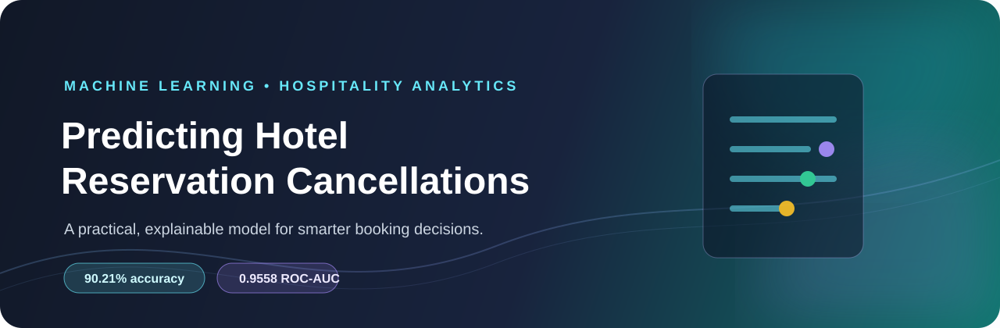
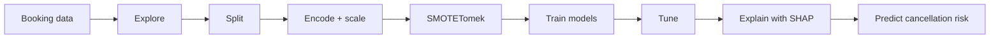

<div align="center">



# Predicting Hotel Reservation Cancellations

**A practical machine learning project for identifying cancellation risk before check-in.**

[](./Notebook/Predicting_Hotel_Reservation_Cancellations.ipynb)
[](https://colab.research.google.com/github/Rohan-Rg30/Predicting_Hotel_Reservation_Cancellations/blob/main/Notebook/Predicting_Hotel_Reservation_Cancellations.ipynb)
[](https://github.com/Rohan-Rg30/Predicting_Hotel_Reservation_Cancellations)

</div>

---

## The idea

Cancellations leave hotels with empty rooms, uncertain revenue, and less time to react. This project turns reservation details into a **cancellation-risk prediction** that can support smarter follow-ups, inventory planning, and revenue decisions.

It is built as a complete, explainable notebook—not just a model training script.

## Project snapshot

| 36,275 | 19 | 6 | 90.21% | 0.9558 |
|:---:|:---:|:---:|:---:|:---:|
| reservations | columns | models benchmarked | test accuracy | test ROC-AUC |

<br />

<div align="center">

### What makes it portfolio-ready

`EDA` &nbsp;→&nbsp; `Leakage-aware preprocessing` &nbsp;→&nbsp; `SMOTETomek` &nbsp;→&nbsp; `Model comparison` &nbsp;→&nbsp; `GridSearchCV` &nbsp;→&nbsp; `SHAP` &nbsp;→&nbsp; `Live prediction function`

</div>

## Results

The benchmark uses a stratified 80/20 split. Preprocessing and resampling are fitted on the training partition, while the test partition remains untouched.

| Model | Accuracy | F1 | ROC-AUC |
|:--|--:|--:|--:|
| **Random Forest** | **90.21%** | **84.89%** | **0.9558** |
| Gradient Boosting | 88.48% | 82.24% | 0.9460 |
| XGBoost | 88.05% | 81.77% | 0.9448 |
| Decision Tree | 86.22% | 79.69% | 0.9292 |
| AdaBoost | 79.89% | 72.58% | 0.8783 |
| Logistic Regression | 78.62% | 70.36% | 0.8712 |

> **Best baseline:** Random Forest. After tuning, its cross-validated ROC-AUC reached **0.9812**.

## How it works



## Signals the model learns from

- **Lead time** — the gap between booking and arrival.
- **Market segment** — online, corporate, offline, aviation, or complementary.
- **Guest history** — repeat-guest behavior and previous booking outcomes.
- **Special requests** — a useful signal of booking intent in this dataset.
- **Stay and pricing details** — nights, guests, room type, meal plan, price, and parking.

These are associations found in this dataset, not universal hotel rules. Any production use should be validated against a hotel’s own booking history.

<details>
<summary><strong>Technical details</strong></summary>

### Dataset

Source: [Hotel Reservations Dataset on Kaggle](https://www.kaggle.com/datasets/ahsan81/hotel-reservations-classification-dataset)

- **Target:** `booking_status` → `Canceled` / `Not_Canceled`
- **Rows:** 36,275
- **Columns:** 19, including 18 features and the target
- **Raw CSV:** not stored in this repository

### Models

The notebook compares Logistic Regression, Decision Tree, Random Forest, Gradient Boosting, XGBoost, and AdaBoost using accuracy, precision, recall, F1, and ROC-AUC.

### Explainability

SHAP is used with the tuned Random Forest to show which reservation features push the prediction toward cancellation or non-cancellation.

### Interactive prediction

The notebook includes `predict_custom_reservation()`, a CLI-style function that accepts a hypothetical reservation and returns a cancellation prediction with a probability score.

</details>

<details>
<summary><strong>Validation note</strong></summary>

The notebook includes a leakage audit and confirms that the encoder, scaler, and SMOTETomek workflow are fit without using test labels. It also detects **33,881 exact duplicate feature rows shared between the train and test partitions**.

This means a random split may produce an optimistic estimate because identical rows can appear on both sides. The reported metrics are useful project benchmarks, but they should not be treated as production guarantees.

**Next step:** deduplicate the source data and evaluate with a time-based split that trains on earlier bookings and tests on later bookings.

</details>

## Run it locally

```bash
git clone https://github.com/Rohan-Rg30/Predicting_Hotel_Reservation_Cancellations.git
cd Predicting_Hotel_Reservation_Cancellations

python -m venv .venv
source .venv/bin/activate          # macOS/Linux
# .venv\Scripts\Activate.ps1     # Windows PowerShell

pip install jupyter pandas numpy matplotlib seaborn scikit-learn xgboost imbalanced-learn shap
jupyter notebook Notebook/Predicting_Hotel_Reservation_Cancellations.ipynb
```

Or skip setup and [run the notebook in Google Colab](https://colab.research.google.com/github/Rohan-Rg30/Predicting_Hotel_Reservation_Cancellations/blob/main/Notebook/Predicting_Hotel_Reservation_Cancellations.ipynb).

## Repository

```text
├── assets/
│   └── hotel-cancellation-banner.svg
├── Notebook/
│   └── Predicting_Hotel_Reservation_Cancellations.ipynb
├── .gitignore
└── README.md
```

## Next up

- [ ] De-duplicate the source data and add time-based validation
- [ ] Calibrate the cancellation probability threshold
- [ ] Build a Streamlit dashboard for hotel teams
- [ ] Deploy the model through FastAPI
- [ ] Add seasonality, holidays, and event features
- [ ] Monitor drift as booking behavior changes

## Author

**Rohan Gaikwad** · Data Scientist

[LinkedIn](https://www.linkedin.com/in/rohan-gaikwad-8b1976418) · [GitHub](https://github.com/Rohan-Rg30)

<div align="center">

---

**If you find this useful, a ⭐ on the repository is appreciated.**

</div>

### References

[1]: https://www.kaggle.com/datasets/ahsan81/hotel-reservations-classification-dataset "Hotel Reservations Dataset"
[2]: https://scikit-learn.org/stable/ "scikit-learn documentation"
[3]: https://imbalanced-learn.org/stable/ "imbalanced-learn documentation"
[4]: https://shap.readthedocs.io/en/latest/ "SHAP documentation"
